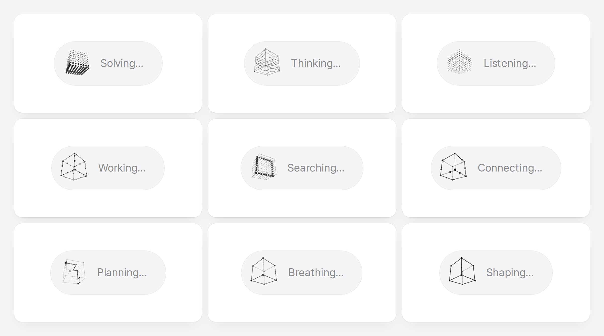

<div align="center">

# Thinking Cube

**Wireframe-cube loading indicators for AI interfaces.**<br>
Nine hand-tuned states. One canvas. Zero dependencies.

[Live demo](https://design.sanskarshukla.com/thinking-cube) · [Install](#install) · [States](#states) · [API](#api)

<br>

<picture>
  <source media="(prefers-color-scheme: dark)" srcset="media/preview-dark.png">
  
</picture>

</div>

<br>

## Why

AI products spend a lot of time waiting. A spinner says "loading". Thinking Cube says *what kind* of thinking is happening: searching, planning, solving, listening. Each state has its own motion, so the indicator carries meaning, not just time.

It is the cube companion to [thinking-orbs](https://libraries.dev/orbs). Same props, same monochrome dotted language, a different shape. If you use orbs today, swapping in a cube is a one-line change.

- **Zero runtime dependencies.** No Three.js, no WebGL. Plain 2D canvas with a small projection engine.
- **Built for two sizes.** Tuned by hand at `64` (avatar) and `20` (inline next to text). Anything in between interpolates.
- **Looks right everywhere.** Crisp on Retina, follows your light or dark theme automatically.
- **Polite by default.** Pauses when off-screen or in a background tab, and respects reduced motion.

## Install

Thinking Cube is a single file. Copy [`ThinkingCube.tsx`](./ThinkingCube.tsx) into your project. The only requirement is React 18 or newer.

> An npm package (`thinking-cube`) is on the way.

## Usage

```tsx
import { ThinkingCube } from './ThinkingCube';

export function AgentStatus() {
  return (
    <div className="status">
      <ThinkingCube state="searching" size={20} />
      <span>Searching the docs…</span>
    </div>
  );
}
```

Use `size={64}` for an avatar or hero spot, `size={20}` inline beside a status label.

## States

| State | What it shows |
| --- | --- |
| `working` | A fast turn while particles race along every edge. |
| `searching` | A scan plane sweeps left and right through a cube built from dots. |
| `solving` | Slabs twist in quarter turns like a Rubik's cube, scramble, then click back to solved. |
| `listening` | A slow, two-tempo wave rolls through the dot cube, waiting for input. |
| `connecting` | Light travels along all twelve edges in both directions. |
| `weaving` | A route planner. A path picks its way node to node toward the far corner, weighing the options it passes, then commits. |
| `composing` | Bands of dots undulate around the faces like lines on a score. |
| `breathing` | The cube expands and contracts on a calm sine wave. |
| `shaping` | Edges draw in one by one, the faces fill, then everything dissolves and starts again. |

## API

| Prop | Type | Default | Description |
| --- | --- | --- | --- |
| `state` | `CubeState` | `'working'` | Which animation to show. One of the nine states above. |
| `size` | `number` | `64` | Size in CSS pixels. The canvas renders at device pixel ratio for sharp edges. |
| `speed` | `number` | `1` | Animation clock multiplier. |
| `dark` | `boolean` | | Force light ink (`true`) or dark ink (`false`). Omit it to auto-detect. |
| `theme` | `'auto' \| 'dark' \| 'light'` | `'auto'` | Used when `dark` is not passed. Reads `data-theme` or a `.dark` class on any ancestor, then `prefers-color-scheme`. |
| `paused` | `boolean` | `false` | Freeze the current frame and stop the animation loop. |

Any other canvas attributes (`className`, `style`, `aria-label`…) pass straight through.

The file also exports `CUBE_STATES` (the list of states), the `CubeState`, `CubeTheme` and `ThinkingCubeProps` types, and `renderCubeFrame(ctx, state, size, t, dark)` if you want to draw a frame yourself.

## Accessibility and performance

- Renders as `role="img"` with a readable label per state (for example "Searching…"). Override it with `aria-label`.
- With `prefers-reduced-motion`, it draws a single still frame instead of animating.
- One `requestAnimationFrame` loop per cube. It stops completely when paused, unmounted, scrolled off-screen, or in a hidden tab.
- The animation clock survives prop changes, so toggling `paused`, `speed` or the theme never jumps the motion back to the start.

## How it works

The cube is drawn on a 2D canvas with a small hand-written projection. The camera sits at a fixed three-quarter view and only turns around the vertical axis, so the cube always reads as a cube: vertical edges stay vertical and opposite edges stay close to parallel. Back edges are faded by face visibility, dots are depth-sorted, and size and brightness carry the sense of depth.

## Run the demo locally

```bash
git clone https://github.com/sanskar0627/thinking-cube.git
cd thinking-cube
npm install
npm run dev
```

| Path | What it is |
| --- | --- |
| `ThinkingCube.tsx` | The component and its animation engine. The only file you need. |
| `src/` | The demo site: preview grid, install docs and playground. |

## Credits

Inspired by [thinking-orbs](https://libraries.dev/orbs) by [Jakub Antalik](https://libraries.dev). Thinking Cube keeps its API and visual language, and the Rubik solve cycle and lattice motion are adapted from its MIT-licensed engine.

## License

[MIT](./LICENSE) © Sanskar Shukla
